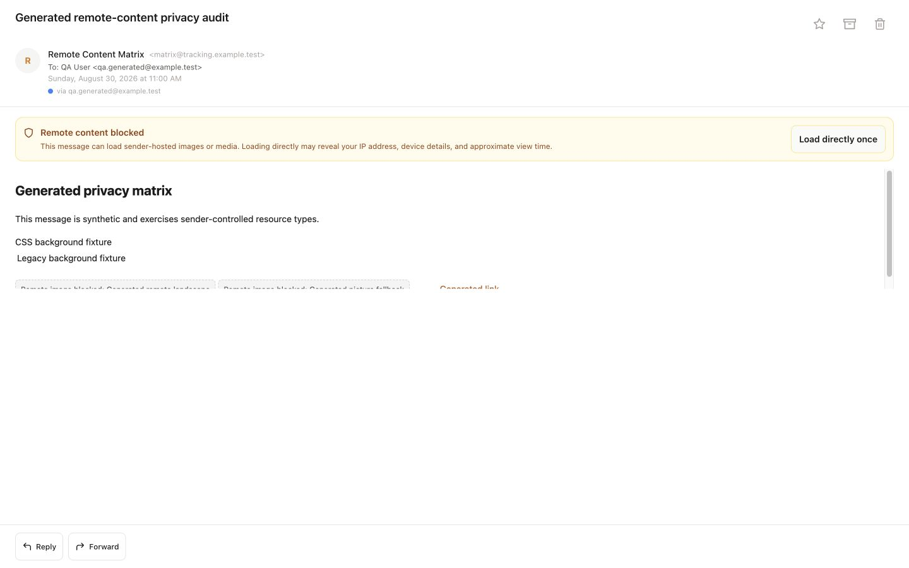
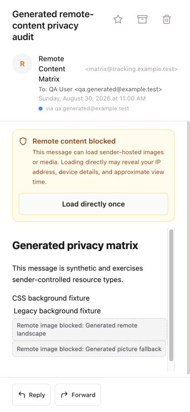
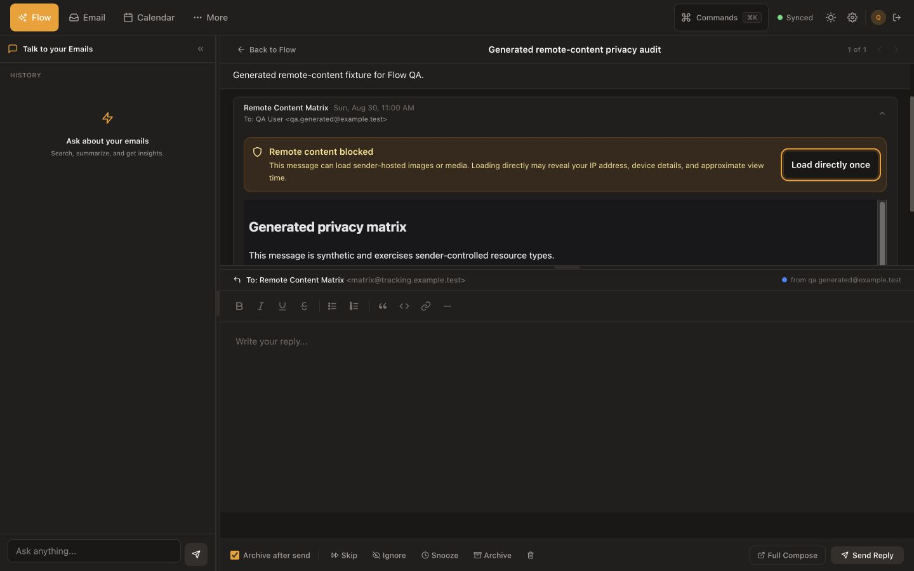

# Remote-Content Privacy Release — 2026-08-30

## Outcome

HTML mail no longer contacts sender-controlled servers merely because a user
opens a message. Remote images, media, stylesheets, CSS resources, legacy
backgrounds, SVG references, and tracking pings are blocked by default across
Inbox, standalone/subscription reading, and Flow. The UI explains what was
blocked and offers a message-scoped direct-load choice with accurate privacy
language. The display can be hidden again, but requests already made cannot be
undone.

All implementation and browser QA used immutable `.example.test` messages and
localhost beacons. No real message was opened, marked read, changed, replied
to, forwarded, or sent.

## User-Facing Changes

- A visible `Remote content blocked` region appears only when sanitized mail
  contains an auto-loading network resource.
- The notice explains that direct loading can disclose view time, IP address,
  and device details.
- `Load directly once` appears only when the message has images or media that
  the action can permit. It applies only to the exact message HTML currently
  displayed and does not create a sender exception or survive a reload or
  message change.
- After direct loading is enabled, the same focused 44 px control becomes
  `Hide remote content`. The status copy says that already-made requests cannot
  be undone; it does not claim that every permitted resource loaded.
- Messages containing only permanently blocked styles, pings, or external SVG
  references explain their removal without offering an ineffective action.
- Safe embedded PNG, GIF, JPEG, WebP, or AVIF data images remain visible
  without a warning or network request. CID references remain network-inert
  and render as an accessible unavailable-image placeholder until owned CID
  mapping exists.
- Blocked images use deliberate, accessible placeholders that retain useful
  alternative text instead of exposing browser broken-image chrome.
- Flow now follows live dark/light theme changes through the same renderer as
  Inbox—including System theme changes—instead of retaining a stale light
  iframe or re-requesting approved resources.
- Sender links are user-activated only and open through the parent with
  `noopener,noreferrer`; the iframe no longer receives popup permission.
- Forwarded mail keeps readable text, headings, tables, and links while
  dropping sender styles and all auto-loading resource markup before Compose.

## Security Boundary

The new shared frame applies both structural rewriting and a restrictive CSP.
Sender markup is first parsed in a detached template owned by a hidden frame
whose no-network CSP already exists; DOMPurify then sanitizes it in place. This
prevents a browser preload scanner from getting ahead of the sanitizer. Before
explicit loading, the reader permits only inline style plus bounded embedded
resource schemes and denies default, script, object, frame, connection, worker,
manifest, prefetch, base, and form sources. A new iframe is mounted for each
policy change because a CSP cannot safely be relaxed in-place.

The one-message opt-in permits direct absolute HTTP(S) images and media on
external hosts only; relative and same-host values never become authenticated
app requests. Permission
state and permanent removals are counted separately so the UI never offers an
action that cannot restore a visible resource. External
stylesheets, remote CSS and fonts, tracking pings/attribution, external SVG
references, scripts, frames, objects, forms, and executable URLs
remain blocked. Requests use no referrer. This release intentionally does not
claim proxy protection or invisible opens.

The Compose boundary is stricter because quoted mail enters the application
document: it removes sender `<style>`/`<link>`, inline styles, legacy
backgrounds, remote images/media/SVG resources, and active content before the
basic or Tiptap editor mounts. Tiptap accepts only embedded raster/CID image
sources when parsing HTML.

## Files Changed

| Area | Files | Change |
| --- | --- | --- |
| Shared reader | `frontend/src/components/email/EmailHtmlFrame.svelte` | Central privacy notice, CSP frame, per-message state/reset, resizing, System-aware theme synchronization without reload, safe link handoff |
| Reader integration | `frontend/src/components/email/EmailView.svelte`, `frontend/src/pages/Flow.svelte` | Replace two drifting iframe implementations with the shared boundary |
| Sanitization | `frontend/src/lib/sanitize.js`, `frontend/src/lib/remoteContent.js` | CSP-lock the parse, classify/remove resource attributes and CSS/SVG references, create accessible placeholders, separate display and Compose policies, build CSP |
| Compose/Forward | `frontend/src/components/email/DeferredRichEditor.svelte`, `frontend/src/components/email/RichEditor.svelte`, `frontend/src/components/email/EmailView.svelte` | Strip quoted sender resources/styles, escape forward headers, prevent remote image parsing in both editors |
| Tests | `frontend/src/lib/remoteContent.test.js` | Embedded/remote URL, CSS escape/import/image-set, resource attribute, and CSP assertions |
| Browser QA | `scripts/qa/generated_remote_content_server.mjs` | Immutable mixed, embedded, permanently blocked, and permission-reset messages; resource beacon; Inbox/Flow/Compose API fixtures; mutation/unknown-route audits |
| Evidence | `docs/progress/REMOTE_CONTENT_*_2026-08-30.jpg`, `docs/progress/REMOTE_CONTENT_QA_AUDIT_2026-08-30.json` | Desktop, exact-375, dark Flow, and immutable request-audit evidence |
| Project state | `docs/progress/CURRENT.md`, `docs/progress/DECISIONS.md`, this file | Current truth, durable policy, scope, validation, limitations, rollback |

## Generated Browser Evidence

### Desktop blocked state

### Exact 375 px blocked state

### Dark Flow state

The exact-375 notice and action remain within the viewport, have no horizontal
overflow, and expose a 44 px action target. The dark Flow iframe background is
`rgb(24, 24, 27)`, matching the active application theme.
The browser asserted a true `innerWidth`/root/scroll width of 375 px; because
the capture backend halves narrow child-frame raster output, the generated QA
wrapper scales only the evidence bitmap while retaining an exact 375×812 inner
CSS viewport.

## Verification

- `make check`: 303 backend tests passed, 4 opt-in PostgreSQL tests skipped,
  113 frontend tests passed, and the 502-module production build completed.
- `node --check scripts/qa/generated_remote_content_server.mjs`: passed.
- `git diff --check`: passed.
- Blocked standalone, Inbox, and Flow: zero resource attempts, mailbox
  mutations, or unknown routes.
- Safe embedded raster fixture: visible with no privacy notice and zero
  resource attempts.
- Explicit generated opt-in: exactly the browser-selected `srcset` candidate
  plus expected picture, poster, video, SVG image, and legacy backgrounds;
  every request had a null referrer. CSS, font, ping, SVG filter/use, and
  stylesheet beacons remained untouched. Relative and absolute same-host image
  vectors also remained blocked and never reached the authenticated app API.
- Generated A → B → A navigation cleared approval and the live announcement;
  returning to A showed `Load directly once` and issued no new request.
- A live theme toggle changed the frame to dark entirely through CSS variables
  and did not repeat any of the seven approved requests.
- A permanently-blocked-only message offered no action, while the embedded
  raster message showed no privacy notice. Both issued zero requests.
- Forward/Compose: readable quoted text remained; sender URLs and all
  `img`, `video`, `audio`, `source`, `track`, `link`, `style`, and SVG resource
  elements were absent. Resource, mutation, and unknown-route audits remained
  empty.
- Flow collapse removed the privacy region and message iframe entirely. Dark
  mode updated the shared iframe, and browser warning/error logs were empty.

## Deliberate Limitations

- `Load directly once` is disclosed permission for direct requests, not a
  privacy proxy. Hiding the display later cannot undo requests already made.
- No persistent sender/domain/global exceptions are included. Those controls
  would be unsafe or misleading without the owned proxy and reversible
  server-side policy model.
- External CSS and fonts remain blocked after opt-in, so some marketing layouts
  will remain visually simplified.
- Gmail Content-ID metadata is not yet exposed and rewritten to owned inline
  attachment URLs, so those images use an `Inline image unavailable`
  placeholder even though they do not contact a sender.
- The audit identified a pre-existing blind-SSRF path in AI Markdown image
  validation and a separate third-party subscription-favicon request. Both are
  recorded in `CURRENT.md`; the AI path was not edited because another process
  owns that worktree.

## Deployment and Rollback

This is a frontend-only release: no migration, database write, Python
dependency, Caddy/systemd change, or service restart is required. Deployment
fast-forwards the reviewed commit, runs the locked frontend install, and builds
the static assets.

Rollback returns production to `ee93396`, runs the locked frontend install and
build, and leaves the database/schema untouched. The exact release commit and
post-deploy evidence will be recorded here after the authorized deployment.
